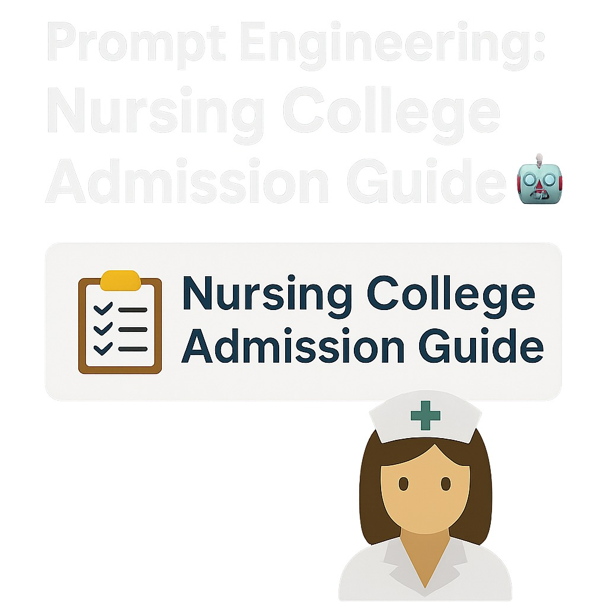

# Prompt Engineering: Nursing College Admission Guide 📚🤖

  

A professional, structured conversational flow designed to guide prospective B.Sc. Nursing students through the admission process at LiaPlus AI. This repository contains the full assignment in PDF format, along with this README providing context, usage instructions, and highlights of the design.

---

## 📖 Table of Contents

1.⁠ ⁠[Overview](#overview)
2.⁠ ⁠[Key Features](#key-features)
3.⁠ ⁠[How to View](#how-to-view)
4.⁠ ⁠[Conversation Flow Highlights](#conversation-flow-highlights)
5.⁠ ⁠[Usage & Customization](#usage--customization)
6.⁠ ⁠[Author](#author)
7.⁠ ⁠[License](#license)

---

## 🌟 Overview

This prompt engineering assignment demonstrates the creation of an AI-driven dialogue that:

•⁠  ⁠Checks initial admission interest and eligibility (Biology in 12th grade)
•⁠  ⁠Provides detailed program information, fee structure, hostel & training facilities
•⁠  ⁠Describes college location, accreditation, clinical training sites, scholarships, and seat availability
•⁠  ⁠Manages diverse user responses—both positive and negative—with professional, user-friendly handling

	⁠“A concise, clear, and context‑aware conversational design that enhances candidate experience.”

---

## 🔑 Key Features

•⁠  ⁠*Structured Flow:* Logical progression from eligibility check to final details
•⁠  ⁠*Multi‑step Handling:* Seamless branching on user inputs (“Yes/Haan” vs. “No/Nahi”)
•⁠  ⁠*Professional Tone:* Consistent, clear, and empathetic language
•⁠  ⁠*Complete Coverage:* All required topics—fees, facilities, accreditation, clinical sites, scholarships, seats
•⁠  ⁠*Easy Navigation:* Table of Contents and PDF embed/link for instant access

---

## 📂 How to View

The full assignment is available as a PDF:

1.⁠ ⁠*Clone this repository*

   ⁠ bash
   git clone https://github.com/RizwanSaifi571/Prompt-Engineering-Nursing-Admission-Flow.git
   cd Prompt-Engineering-Nursing-Admission-Flow
    ⁠
2.⁠ ⁠*Open the PDF*

   * Double‑click ⁠ Prompt-Engineering-Assignment.pdf ⁠ in your file explorer
   * Or view online by clicking the PDF badge at the top

---

## 💬 Conversation Flow Highlights

| Step                       | Description                                                         |
| -------------------------- | ------------------------------------------------------------------- |
| *1. Initial Interest*    | Ask: “Are you interested in admission to our B.Sc Nursing program?” |
| *2. Eligibility Check*   | Verify 12th‑grade Biology; if absent, inform requirement            |
| *3. Program Details*     | Outline full‑time program and ask if more details are needed        |
| *4. Fee Structure*       | Break down ₹60,000 tuition + ₹10,000 bus; 3 installments            |
| *5. Facilities*          | Describe hostel, security, warden, training with real patients      |
| *6. Location & Training* | Delhi campus; clinical sites in Backundpur, Chartha, Ranchi         |
| *7. Accreditation*       | Recognized by Indian Nursing Council (INC) Delhi                    |
| *8. Scholarships*        | Govt. Post‑Matric (₹18k‑23k), Labour Ministry (₹40k‑48k)            |
| *9. Seats & Eligibility* | Total 60 seats; PNT Exam pass; age 17–35                            |
| *10. Response Handling*  | Branch on positive (“Haan”) vs. negative (“Nahi”) replies           |

---

## ⚙️ Usage & Customization

•⁠  ⁠*Adapt the PDF*: Replace ⁠ Prompt-Engineering-Assignment.pdf ⁠ with your updated file.
•⁠  ⁠*Extend Flow*: Use this template to add more branches (e.g., hostel booking, scholarship applications).
•⁠  ⁠*Integrate in Chatbot*: Export sections into your bot framework (Dialogflow, Rasa, etc.) as intents and responses.

---

## 👤 Author

*Rizwan Saifi*

•⁠  ⁠GitHub: [@RizwanSaifi571](https://github.com/RizwanSaifi571)
•⁠  ⁠LinkedIn: [in/rizwansaifi2614](https://linkedin.com/in/rizwansaifi2614)
•⁠  ⁠Portfolio: [rizwansaifi571.github.io](https://rizwansaifi571.github.io)

---

## 📄 License

This project is licensed under the MIT License. See the [LICENSE](LICENSE) file for details.

